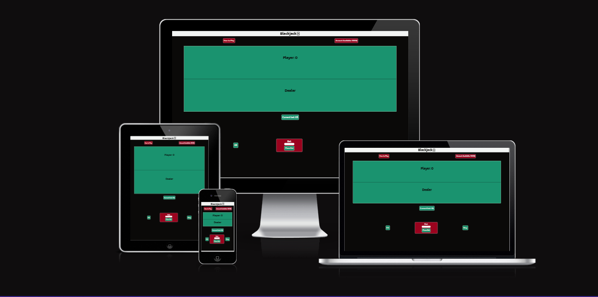
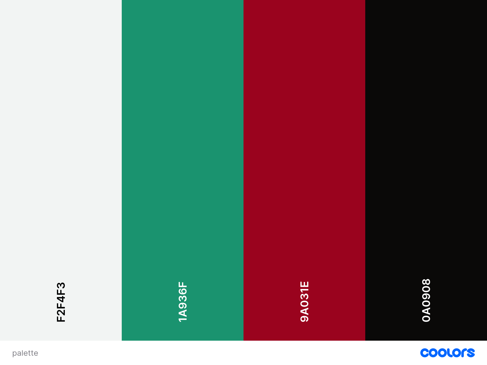
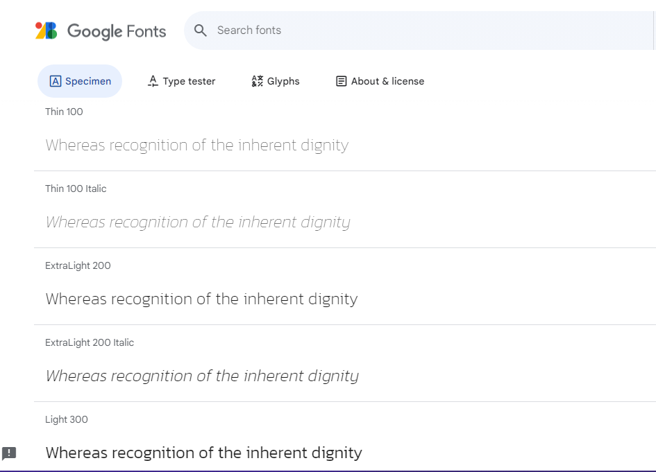
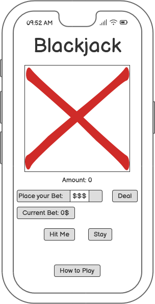
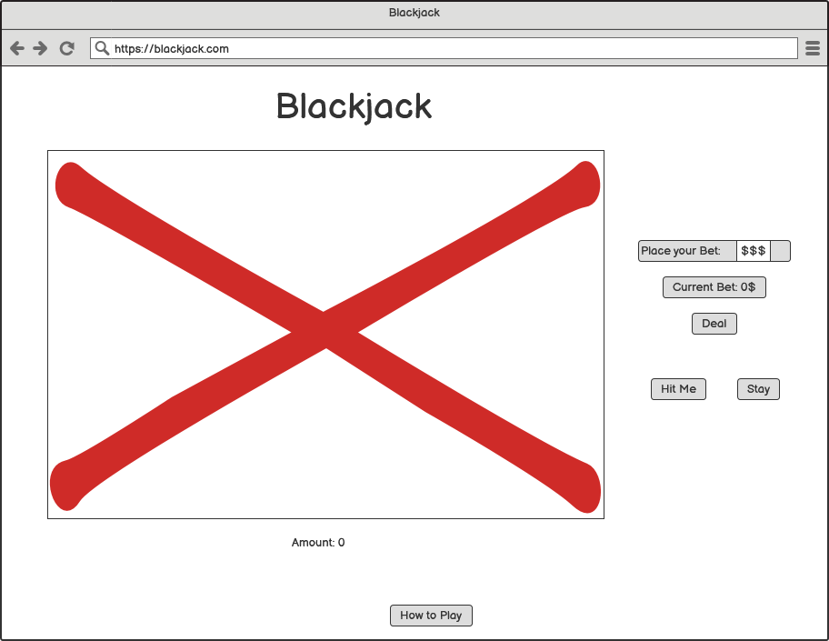

# Blackjack

Blackjack is a classic casino game of chance and strategy. Blackjack is one of the most popular casino games in the world, partly due to the fact that it's an easy game to learn and build strategies upon. Whilst considered a game of luck, statistics play a massive role in the game as well, and mathematicians and intellectuals from all over the world are fascinated by the idea of making money through pure stats.

See the live website here: [Blackjack](https://petra66orii.github.io/blackjack/)

# Table of Contents
1. **[Target Audience](#target-audience)**
   * [User Stories](#user-stories)
   * [User Goals](#user-goals)
   * [Business Goals](#business-goals)
2. **[Design](#design)**
   * [Color Scheme](#color-scheme)
   * [Typography](#typography)
       + [Kanit](#kanit)
   * [Imagery](#imagery)
   * [Wireframes](#wireframes)
       + [Mobile View](#mobile-view)
       + [Desktop View](#desktop-view)
3. **[Features](#features)**
   * [General Features](#general-features)
       + [Header Bar](#header-bar)
   * [Features](#features)
   * [Future Implementations](#future-implementations)
   * [Accessibility](#accessibility)
4. **[Technologies Used](#technologies-used)**
5. **[Languages Used](#languages-used)**
6. **[Deployment & Local Development](#deployment--local-development)**
   * [Deployment](#deployment)
       + [How to Deploy](#how-to-deploy)
   * [Local Development](#local-development)
       + [How to Clone](#how-to-clone)
       + [How to Fork](#how-to-fork)
7. **[Testing](#testing)**
   * [Validation](#validation)
       + [HTML Validator](#html-validator)
       + [CSS Validator](#css-validator)
       + [JSHint](#jshint)
       + [Lighthouse](#lighthouse)
   * [Accessibility](#accessibility)
   * [Devices Used](#devices-used)
       + [Laptops](#laptops)
       + [Mobile Devices](#mobile-devices)
       + [Browsers Used](#browsers-used)
   * [Full Testing](#full-testing)
   * [Bugs](#bugs)
8. **[Credits](#credits)**
   * [Code Used](#code-used)
   * [Content](#content)
   * [Acknowledgements](#acknowledgements)

# Target Audience

This game is destined for anyone who wants to have a little fun, and get the thrill of betting without actually putting any money on the line. This game can be great practice to find and develop strategies before trying your luck at the casino! It's also a fun game to help develop your maths and statistics skills!

## User Stories

* As a first time user, I expect a pleasant design.
* As a first user, I expect to have a fun experience and to play proper Blacjack.

# Design

## Color Palette
For the color scheme I chose these four colors that go with the cards displayed as well. The green color in the background is meant to mimic the tables in casinos, giving it an authentic feel to the game.

## Typography

For the font I went with a simple Kanit font that stands out and it's elegant.

### Kanit

## Wireframes

This initial design was made using Balsamiq. The mobile design is aiming to contain everything without scrolling down or with minimal scrolling, and the same idea is kept in mind while designing the desktop version.

### Mobile View

### Desktop View

# Features

# Deployment & Local Development

## Deployment

### How to Deploy
1. Log in to your GitHub account
2. Go to the repository of this project /petra66orii/blackjack/
3. Under the repository name, click on Settings
4. On the left side of the page, click Pages
5. Select 'Deploy from a branch' under the 'Build and deployment' section
6. Set branch to 'root'
7. Click 'Save'
8. It might a few minutes to see the deployed website

## Local Development

### How to Clone
1. Log into your account on GitHub
2. Go to the repository of this project /petra66orii/blackjack/
3. Click on the code button, and copy your preferred clone link
4. Open the terminal in your code editor and change the current working directory to the location you want to use for the cloned directory
5. Type 'git clone' into the terminal, paste the link you copied in step 3 and press enter

### How to Fork
To fork the repository:
1. Log in (or sign up) to Github.
2. Go to the repository for this project, petra66orii/blackjack
3. Click the Fork button in the top right corner.

# Technologies Used

* HTML
* CSS
* JavaScript
* Deck of cards API
* GitPod
* 
# Credits

* [Deck of Cards API](https://www.deckofcardsapi.com/)
* [W3Schools JavaScript Tutorial](https://www.w3schools.com/js/default.asp)
* [FreeCodeCamp article on how to use fetch API to make GET requests](https://www.freecodecamp.org/news/make-api-calls-in-javascript/#how-to-use-the-fetch-api-for-get-requests)
* [Bootcamp article on fetching data from an API and render it with CSS and JavaScript](https://bootcamp.uxdesign.cc/fetch-data-from-a-sample-api-and-render-it-in-a-card-using-javascript-and-css-step-by-step-guide-332bd4b70346)
