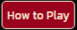
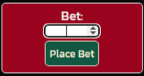
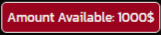
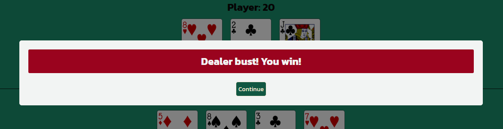
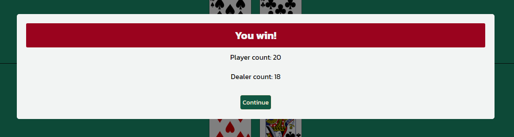
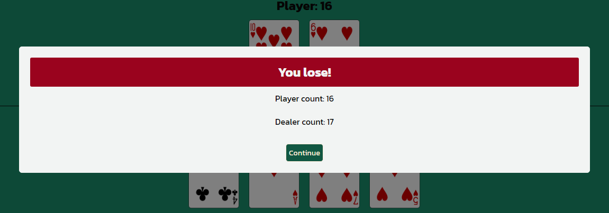
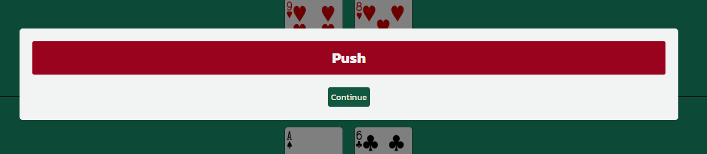
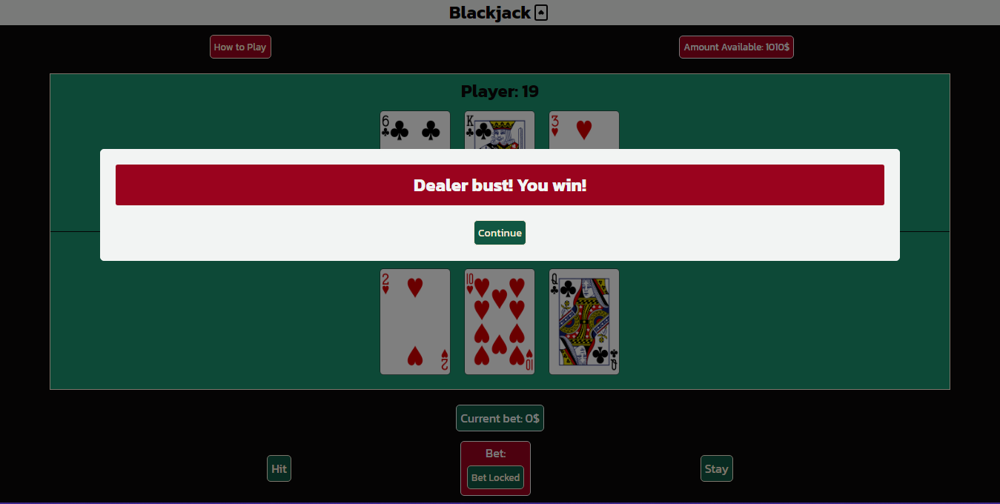

# Blackjack

Blackjack is a classic casino game of chance and strategy. Blackjack is one of the most popular casino games in the world, partly due to the fact that it's an easy game to learn and build strategies upon. Whilst considered a game of luck, statistics play a massive role in the game as well, and mathematicians and intellectuals from all over the world are fascinated by the idea of making money through pure stats.

If you enjoy the experience of playing Blackjack, then this game is for you! It's simple, yet very efficient in providing the excitement a casino game would!

See the live website here: [Blackjack](https://petra66orii.github.io/blackjack/)

# Table of Contents
1. **[Target Audience](#target-audience)**
   * [User Stories](#user-stories)
   * [User Goals](#user-goals)
2. **[Design](#design)**
   * [Color Palette](#color-palette)
   * [Typography](#typography)
       + [Kanit](#kanit)
   * [Imagery](#imagery)
   * [Wireframes](#wireframes)
       + [Mobile View](#mobile-view)
       + [Desktop View](#desktop-view)
3. **[Features](#features)**
   * [Game Features](#game-features)
       + [Logo](#logo)
       + [Game Buttons](#game-buttons)
       + [How to Play Modal](#how-to-play-modal)
       + [Landing Page](#landing-page)
       + [Bet Input Area](#bet-input-area)
       + [Amount Available Section](#amount-available-section)
       + [Game Prompts](#game-prompts)
   * [Gameplay](#gameplay)
   * [Future Implementations](#future-implementations)
   * [Accessibility](#accessibility)
4. **[Technologies Used](#technologies-used)**
5. **[Languages Used](#languages-used)**
6. **[Deployment & Local Development](#deployment--local-development)**
   * [Deployment](#deployment)
       + [How to Deploy](#how-to-deploy)
   * [Local Development](#local-development)
       + [How to Clone](#how-to-clone)
       + [How to Fork](#how-to-fork)
7. **[Testing](#testing)**
   * [Validation](#validation)
       + [HTML Validator](#html-validator)
       + [CSS Validator](#css-validator)
       + [JSHint](#jshint)
       + [Lighthouse](#lighthouse)
   * [Accessibility](#accessibility)
   * [Devices Used](#devices-used)
       + [Laptops](#laptops)
       + [Mobile Devices](#mobile-devices)
       + [Browsers Used](#browsers-used)
   * [Full Testing](#full-testing)
   * [Bugs](#bugs)
       + [Bug #1 - Icon going under the title](#bug-1---icon-going-under-the-title)
       + [Bug #2 - Modal container didn't open](#bug-2---modal-container-didnt-open)
       + [Bug #3 - Cards won't display](#bug-3---cards-wont-display)
       + [Bug #4 - Player and dealer title were overlapping](#bug-4---player-and-dealer-title-were-overlapping)
       + [Bug #5 - "Hit" button would draw card before any cards were dealt](#bug-5---hit-button-would-draw-card-before-any-cards-were-dealt)
       + [Bug #6 - Dealer cards would shuffle on display](#bug-6---dealer-cards-would-shuffle-on-display)
       + [Bug #7 - Game prompt would pop up before the last drawn card was revealed](#bug-7---game-prompt-would-pop-up-before-the-last-drawn-card-was-revealed)
8. **[Credits](#credits)**
   * [Code Used](#code-used)
   * [Content](#content)
   * [Acknowledgements](#acknowledgements)

# Target Audience

This game is destined for anyone who wants to have a little fun, and get the thrill of betting without actually putting any real money on the line. This game can be great practice to find and develop strategies before trying your luck at the casino! It's also a fun game to help develop your maths and statistics skills!

## User Stories

* As a player, I expect a pleasant design and a fully functional game.
* As a player, I expect to have a fun experience and to play proper Blackjack.
* As a player, I expect to balance increasing or decreasing depending on the outcome.

## User goals

The goals are to faithfully reproduce a Blackjack game for people to play and have fun with. There is a betting system in place as well to give that slight dopamine kick when you see money coming in. It's also a good way of practising and developing strategies that can be then implemented at the casino, should the user ever decide to go. 

# Design

## Color Palette
For the color scheme I chose these four colors that go with the cards displayed as well. The green color in the background is meant to mimic the tables in casinos, giving it an authentic feel to the game.

## Typography

For the font I went with a simple Kanit font that stands out and it's elegant.

### Kanit

## Imagery

The cards images were taken from the [Deck of Cards API](https://www.deckofcardsapi.com/) and displayed with the help of JavaScript. The back card image was from the same website.

## Wireframes

This initial design was made using Balsamiq. The mobile design is aiming to contain everything without scrolling down or with minimal scrolling, and the same idea is kept in mind while designing the desktop version.

### Mobile View

### Desktop View

# Features

## Game Features

### Logo

The top of the page displays the logo of the game. 

### Landing Page 

The landing page shows the game area halved in two: the upper section is reserved for the player, whilst the bottom section is reserved for the dealer's section. Above the game area, there is the "How to Play" button on the left, and on the right there is a small box where the amount of cash that have available to spend is displayed. Below the game area there is also another small section where the user can see their placed bet. There are two main buttons that the user plays with, "Hit" and "Stay", each situated on the left-hand side and right-hand side, respectively. In between these two buttons is the "Place Bet" area, where the user can input their desired amount.

### Game Buttons

There are six buttons in this game: 

| Image                                                                    | Button    |
|--------------------------------------------------------------------------|-----------|
|                 | Hit       |
|               | Stay      |
|     |Place Bet  |
| |How to Play|
|       |Continue   |
|   |Start Over |

1. The "Hit" button draws a card every time it's pressed. The count gets updated with every card drawn.
2. The "Stay" button ends the player's turn and the dealer's (PC) turn starts. 
3. The "Place Bet" button is locking the bet, the input field disappears and starts the game.
4. The "How to Play" button opens a modal container that contains the instrictions on how to play Blackjack.
5. The "Continue" button restarts the game with the modified maximum amount available
6. The "Start Over" fully resets the game should the player run out of money

### How to Play Modal

When you click on the "How to Play" button, the instructions modal container comes up where you're explained the rules of blackjack. To exit, you can either click on the "x" in top-right corner, or just click outside of the modal.

### Bet Input Area

#### Before bet is placed:

#### After the bet is placed:

 This field is validated so the user can't input 0 or a negative number, nor can they place a bet with a higher amount than what's available. Doing so will result in one of these messages being displayed:
 
 As it can be noticed, when the user tries to input 0, it displays the above message. 
 
 The same goes with the attempt to bet more than the available amount; in this example, the amount available is 1010, but the user tries to put 1011. As a result, the message above is displayed. 

### Amount Available Section

At the start of the game, the user starts with 1000$. This amount is dynamically changed as the game goes on and bets are being placed. 

### Game Prompts

Depending on the outcome of the game, these are the following prompts that are triggered when:

|          What happened?          |                Display               |
|--------------------------------- |--------------------------------------|
| User hits Blackjack              |  |
| Dealer hits Blackjack            |   |
| User busts                       |   |
| Dealer busts                     |   |
| No Blackjack, user wins          |    |
| No Blackjack, dealer wins        |   |
| Draw (or Push)                   |   |

## Gameplay

The game starts by focusing on the input field, where the user can input their desired amount. After clicking "Place Bet", the cards are dealt for each side, with one card being hidden on dealer's side. The user can notice that their amount available went down from 1000$ to 990$, and in the "Current Bet" box the sum of 10$ is displayed.

The user presses hit and gets dealt a third card:

After the user clicks stay, the dealer's turn starts. The card is shown, and a third card gets dealt:

Score gets updated:

Dealer busts! Clicking on the "Continue" button will restart the game and adjust the "Amount Available". At the same time, the "Current Bet" will revert to 0, and the bet input field is displayed again.

In the eventuality of the player gambling away all of their money:

The game fully resets and the player can resume the game:

## Future Implementations

* This version of Blackjack is simplified, since the game has more rules than what's presented here. For instance, in the real-life game, if you're dealt two Aces from the beginning, you can "split" the bet and the cards into two separate bets to increase your chances of getting Blackjack. That would be the next thing I'd implement. 
* Also, I'd like to put in a leaderboard to see how much can people win.

## Accessibility

* All card images have alt-descriptions.
* There is a high contrast in colors, and the background isn't distracting the user from the content of the webpage.

Passed the Wave test as well with no issues.

# Technologies Used

* **Gitpod** - The IDE where all the coding and commits have been done
* **GitHub** - Where the website is stored and pushed. The website was deployed early via GitHub and it was constantly tested
* **HTML5** - The main structure of the website was created using HTML5
* **CSS** - This was used in order to style the webpage in way that is pleasing to the eye
* **JavaScript** - This was used to code the logic of the game and provide interactivity to the webpage
* **Python** - Python3 was used to preview the website on a local http server
* **Balsamiq** - To create the wireframes
* **Google Chrome** - All the testing and building took place using Google Chrome
* **UNPKG** - The header icon was taken from UNPKG
* **Favicon** - The icon in the browser tab was taken from Favicon
* **DevTools** - Using Google Chromes' DevTools helped me play with the code to find the best properties for my webpage
* **Deck of Cards API** - The cards were sourced from this API
  
# Languages Used

* **HTML**
* **CSS**
* **JavaScript**

# Deployment & Local Development

## Deployment

### How to Deploy
1. Log in to your GitHub account
2. Go to the repository of this project /petra66orii/blackjack/
3. Under the repository name, click on Settings
4. On the left side of the page, click Pages
5. Select 'Deploy from a branch' under the 'Build and deployment' section
6. Set branch to 'root'
7. Click 'Save'
8. It might take a few minutes to see the deployed website

## Local Development

### How to Clone
1. Log into your account on GitHub
2. Go to the repository of this project /petra66orii/blackjack/
3. Click on the code button, and copy your preferred clone link
4. Open the terminal in your code editor and change the current working directory to the location you want to use for the cloned directory
5. Type 'git clone' into the terminal, paste the link you copied in step 3 and press enter

### How to Fork
To fork the repository:
1. Log in (or sign up) to Github.
2. Go to the repository for this project, petra66orii/blackjack
3. Click the Fork button in the top right corner

# Testing 

## Validation

### HTML Validator

The HTML code passed the W3C Validator with no issues. 

### CSS Validator

The CSS was validated using the official CSS Jigsaw validator.

### JSHint Validator

* **No errors came up while testing the JavaScript code.**

* There are a good few warnings, most of them are because of missing semicolons, but should be fixed now.
* There are also warnings regarding the use of functions that are declared outside of loops that can cause confusion. Whilst a bit annoying to see it there, it does not affect the game and I am happy to leave it as is.

### Lighthouse

Passed the Lighthouse test with flying colors. Even the browser's happy!

## Devices Used 
Testing was done on the following devices: 

### Laptops
* HP ProBook
* Acer Aspire E15
* Asus GL702Z

### Mobile Devices
* iPhone 11
* Samsung Galaxy Flip 5
* Samsung Galaxy S10

### Browsers Used
Each device used the following browsers for testing:

* Google Chrome
* Microsoft Edge
* Safari (Mobile only)
* Samsung Internet (Mobile only)

## Full Testing

| What is tested?                                                                               | Result |
|-----------------------------------------------------------------------------------------------|--------|
| When user clicks on "How to Play" button, a modal container appears                           | PASS   |
| When user inputs bet between 1 and 1000, the button "Place Bet" is changed with "Bet Locked"  | PASS   |
| When user inputs bet, the "Amount Available" and "Current Bet" boxes change accordingly       | PASS   |
| If user tries to input 0 or less, an error message appears                                    | PASS   |
| If user tries to input a sum higher than the one available, a different error message appears | PASS   |
| You can't modify the bet after it's put in                                                    | PASS   |
| "Hit" and "Stay" buttons are disabled until bet is placed                                     | PASS   |
| After bet is placed, "Hit" and "Stay" buttons are enabled                                     | PASS   |
| When user clicks "Hit", a card is drawn                                                       | PASS   |
| When user clicks "Stay", the dealer's turn begins and the second card is shown                | PASS   |
| At the end of the game, the appropriate message is being displayed                            | PASS   |
| When the user clicks on the "Continue" button within the message, the game restarts           | PASS   |
| When the user loses all of their money, the game will reset                                   | PASS   |
| If no one hits Blackjack, player with highest score wins and the score is displayed           | PASS   |
| If user types the wrong URL, 404 page is displayed with a link to go back                     | PASS   |
| If score goes over 21 for any player, the game is over and the other player wins              | PASS   |
| Website is fully responsive on all screens                                                    | PASS   |

## Bugs

Of course, like with any project, you come across bugs. And there was no shortage of them...

### Bug #1 - Icon going under the title

- Icon was going under the header, making it look unappealing and taking up unnecessary space. Luckily, all it needed was to change the display of the icon to "inline-flex".

### Bug #2 - Modal container didn't open
- Modal container for instructions wouldn't open because I was using the method 'getElementByClassName' wrong. Since classes aren't restricted to only one element, and therefore can be assigned to any number of elements, it is what is called a 'HTML collection'. To fix this, I needed to put an index of [0] to get that specific element selected in JavaScript.

### Bug #3 - Cards won't display
- The drawDeck() function was written incorrectly, and the cards wouldn't render at all. They would appear in the console as being drawn, but wouldn't show up on the website. 

- After some digging, I came across this [article](https://bootcamp.uxdesign.cc/fetch-data-from-a-sample-api-and-render-it-in-a-card-using-javascript-and-css-step-by-step-guide-332bd4b70346) that used an async/await function to render cards (simple cards, not playing cards, but the concept was the same to me). After adapting the code to my needs, the cards are now displaying.

### Bug #4 - Player and dealer title were overlapping
- Player and dealer titles were overlapping the header.

- A simple fix; it was only because the z-index was set to 999 to stay on top of the cards should the game area collapse in azy way, but forgot that the header had the same z-index value. After noticing that, I changed the z-index to 99.

### Bug #5 - "Hit" button would draw card before any cards were dealt

- The "hit" button worked even if there was no bet placed and/or any cards dealt. But the fix was simpler than I thought: disable the button by default and enable it again once the bet is set.

### Bug #6 - Dealer cards would shuffle on display

- Whenever the dealer was drawing from the deck, the cards would shuffle like in the above example. It wouldn't affect the outcome of the game, but it was aesthaetically unpleasant and confusing for the user. The fix was to nest the entire conditional function within dealerTurn() into a while loop, with the "break" keyword after every condition to ensure the loop stops where needed. I was inspired by this [article](https://www.raymondcamden.com/2023/07/04/creating-a-blackjack-game-with-alpinejs-and-the-deck-of-cards-api).

### Bug #7 - Game prompt would pop up before the last drawn card was revealed
- When the dealer stays and chooses not to draw any new cards, the final message is displayed first and only after that you see the card revealed. That again was a bit annoying from a UX perspective. But a simple setTimeout() function fixed that and every message now comes ONLY after all cards are being displayed.

# Credits

## Code Used

* [W3Schools JavaScript Tutorial](https://www.w3schools.com/js/default.asp)
   - Modal container tutorial helped me with coding the "How to Play" and the pop up messages at the end of the game
   - Async and await functions tutorials helped me code the async functions hitMe(), deal(), dealerTurn() and restartGame()
   - Callback and Promise functions tutorials helped when trying to figure out how to delay the pop up messages from coming up before the score would update
* [FreeCodeCamp article on how to use fetch API to make GET requests](https://www.freecodecamp.org/news/make-api-calls-in-javascript/#how-to-use-the-fetch-api-for-get-requests)
   - Used and adapted this code snippet to use the fetch() method for the Deck of Cards API
* [Bootcamp article on fetching data from an API and render it with CSS and JavaScript](https://bootcamp.uxdesign.cc/fetch-data-from-a-sample-api-and-render-it-in-a-card-using-javascript-and-css-step-by-step-guide-332bd4b70346)
   - Used and adapted part of the code to render cards in the game
* [Raymond Camden article on creating a blackjack game](https://www.raymondcamden.com/2023/07/04/creating-a-blackjack-game-with-alpinejs-and-the-deck-of-cards-api)
   - This article was very useful for getting inspiration on how to work my way around async/await functions in the game
   - Mainly it helped me figure out how to calculate points where there are one or more Aces and how to implement that into the game

## Content
   - The images were all taken from the [Deck of Cards API](https://www.deckofcardsapi.com/)
   - The rules for Blackjack were written by me with help from [ChatGPT](https://chatgpt.com/)
   - Icons were used from [Favicon](https://favicon.io/) (for the browser tab) and [UNPKG](https://unpkg.com/) (for the header icon)
   - Font was taken from [Google Fonts](https://fonts.google.com/)
   - Color palette was determined using [Coolors](https://coolors.co/)
   - I used [Stack OverFlow](https://stackoverflow.com) to solve some code-related problems
   - The gif in the 404 page was taken from this [Wikimedia](https://commons.wikimedia.org/wiki/File:Cards_2.gif)

## Acknowledgements

   - I would like to thank my partner Gerry for giving me the idea for this game and for his unconditional support by testing the game and providing constant feedback.
   - I would also like to thank my mentor Luke for helping me find the best way to tackle this project and for the honest feedback every step of the way.
   - Also I'd like to thank my brother Eric for his support and for testing and providing feedback on the project